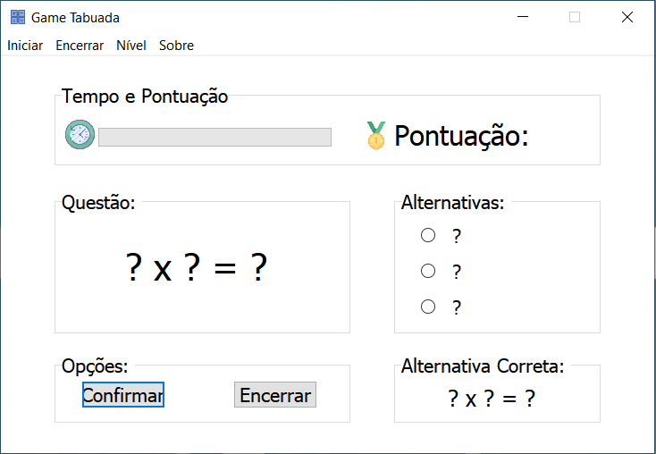
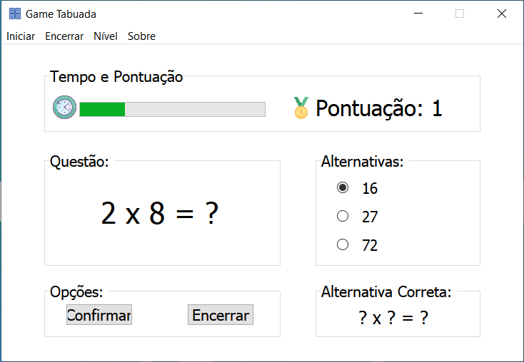
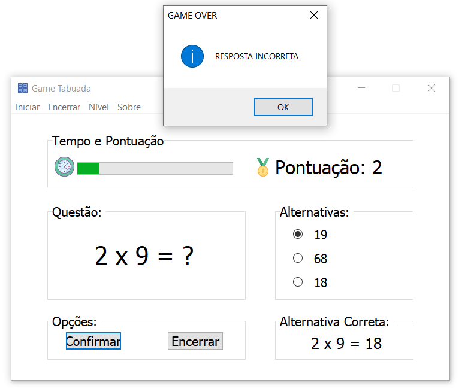

    

<h1 align="center"> 🎮 Game Tabuada 🎮 </h1>

    
    
    

# :bulb: Sobre o projeto
**Game Tabuada** é jogo simples de perguntas e resposta sobre a tabuada para aprender e se divertir.
Este projeto foi desenvolvimento para a aprovação na disciplina de **Paradigmas de Programação**, durante o curso de graduação em **Ciência da computação**.

## :computer: Desenvolvimento
Aplicação desktop desenvolvida em **Pascal** com codigo estruturado, sintaxe simples e bem comentado.
Para o desenvolvimento foi utilizado a IDE [RAD Studio](https://www.embarcadero.com/br/products/rad-studio).

## :camera: Telas da Aplicação

## :tv: Redes Sociais
 Abaixo algumas das minhas redes sociais:
 
    
  
   
  
   

  